## viewport

定义: viewport 是用户网页的可视区域。

什么是用户网页的可视区域？这个概念是有点模糊，是指的是设备可视区域，还是浏览器的可视区域？
因为设备的可视区域是不变的，浏览器的可视区域是可变，设备可视区域>=浏览器可视区域

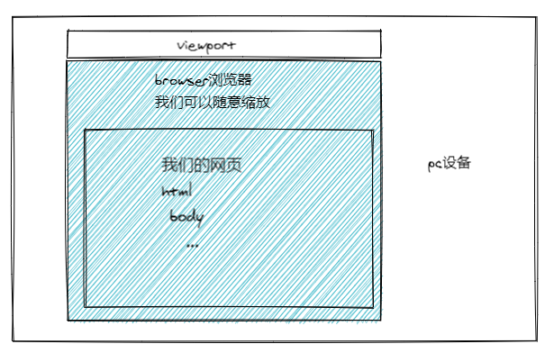

viewport： 网页是显示在浏览器中，那用户网页的可视区域---可以理解为浏览器中实际显示内容的区域
（换句话说是你的不包括工具栏和按钮的网页浏览器，**那么viewport等于浏览器的窗口**

从上面我们可以得出：viewport(浏览器视口) > html整个文档内容


**如何获取viewport的宽度**

```js
// 获取viewport的宽高
document.documentElement.clientWidth/Height
```
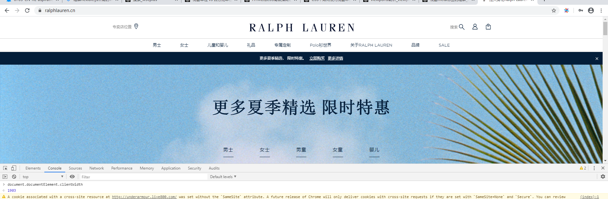
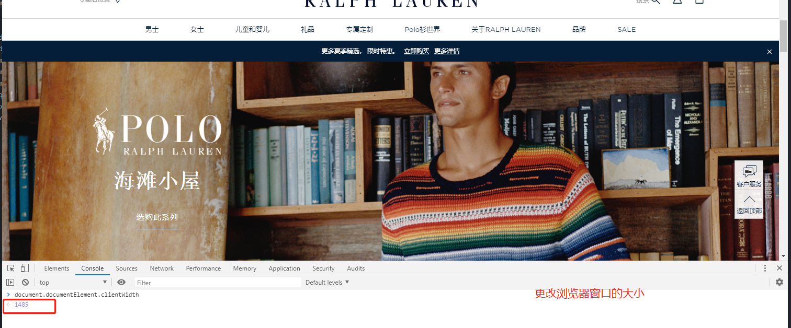
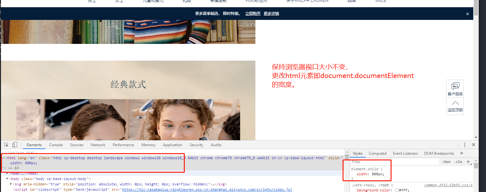
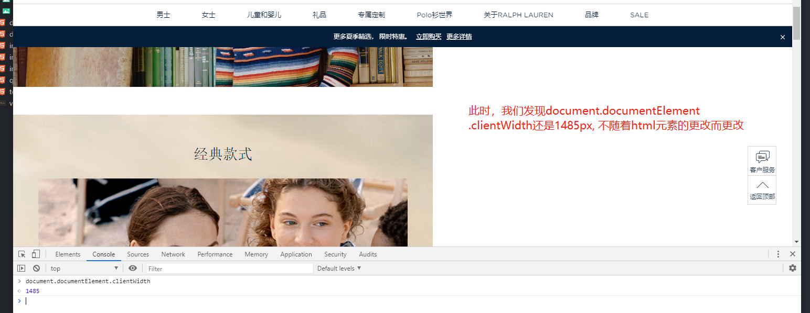
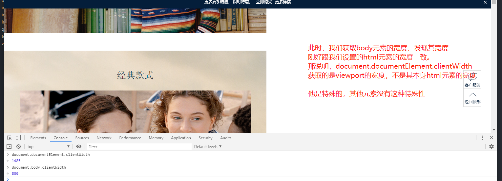
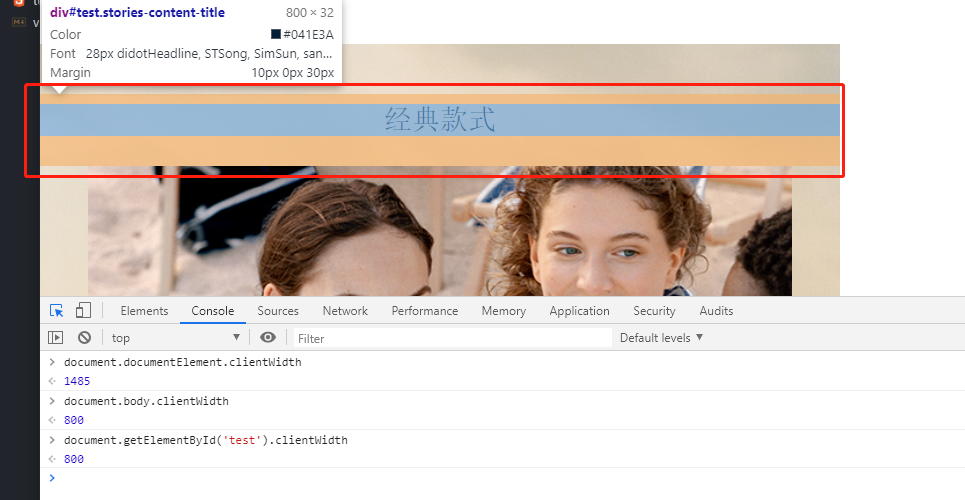

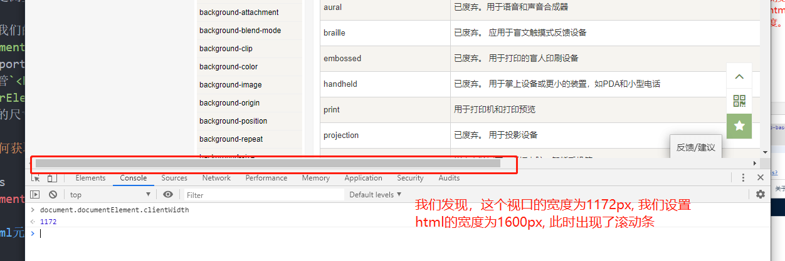

document.documentElement实际上就是`<html>`元素：HTML文档的根元素。
viewport是比`<html>`更高级别的元素，打个比喻，它是容纳`<html>`元素的元素。
按照道理，应该获取的html元素的宽度，但是其实是获取的是浏览器视口的宽度。

经过我们的测试的得到--`document.documentElement.clientWidth/Height`只会给出viewport的尺寸，
而不管`<html>`元素尺寸如何改变。`document.otherElement.clientWidth/Height`则会获取元素
本身的尺寸。

**如何获取`html`元素的尺寸呢？**

```js
document.documentElement.offsetWidth/Height
```


## 设备/浏览器/元素相关尺寸

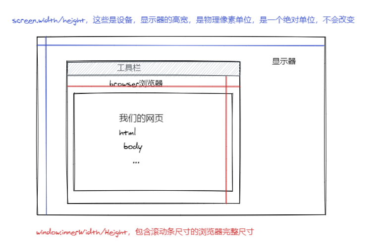


### @media

[media的定义](https://developer.mozilla.org/zh-CN/docs/Web/CSS/@media)

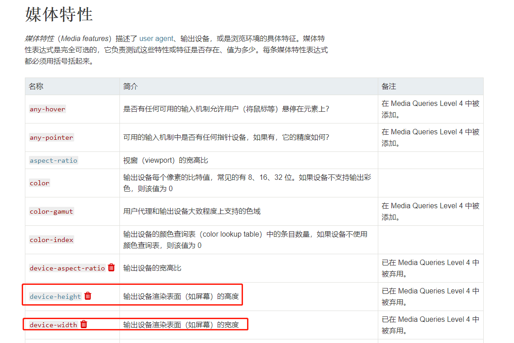


```css
@media only screen
    /* 这个宽度是指的viewpoint视口的宽度 */
  and (min-width: 1100px) {
    body {
        background: red;
    }
}
```

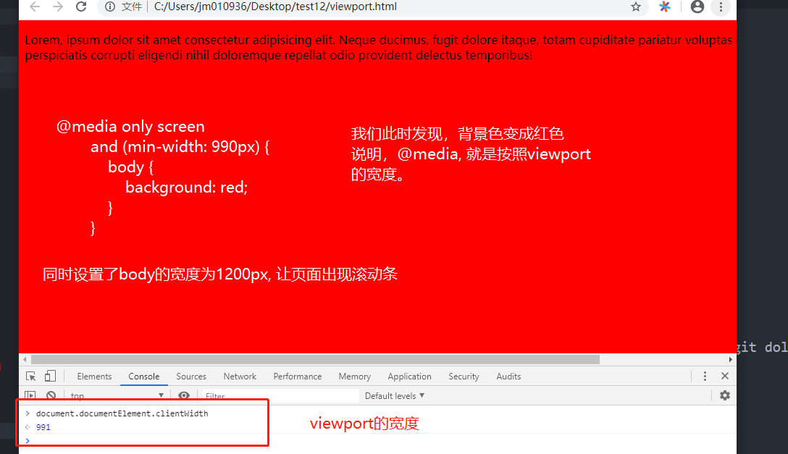
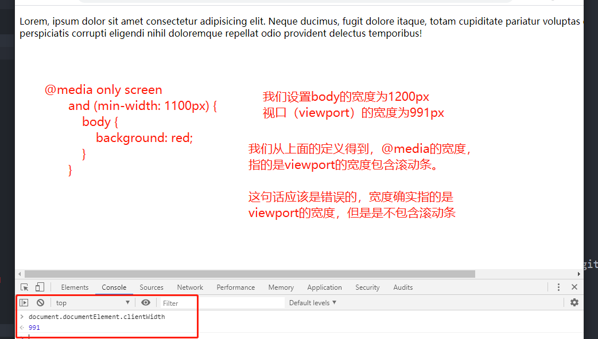

1. 我们从上面知道`device-width`，就是屏幕的宽度，可以使用`screen.width/height`(经过我测试, 在PC端设置，没有效果)
2. `width`指的是`viewport`的宽度，可以使用`document.documentElement.clientWidth`进行获取
3. `device-width/height`使用`screen.width/height`来做为的判定值。该值以设备的pixels来度量
4. `width/height`使用`documentElement.clientWidth/Height`即viewport的值。该值以CSS的pixels来度量


## 移动设备浏览器viewport的问题集合

如果按照桌面浏览器那样的话，viewport是浏览器的视口。那么为桌面端设计的网页，在移动端是展示不完，
存在大部分的滚动条，这个体验是极其不好。所以，移动设备浏览器视口宽度默认为980px（不同的浏览器，可能存在些许差别）
让原本为桌面浏览器设置的网页，可以在移动端浏览器正常展示，但是会进行缩放。

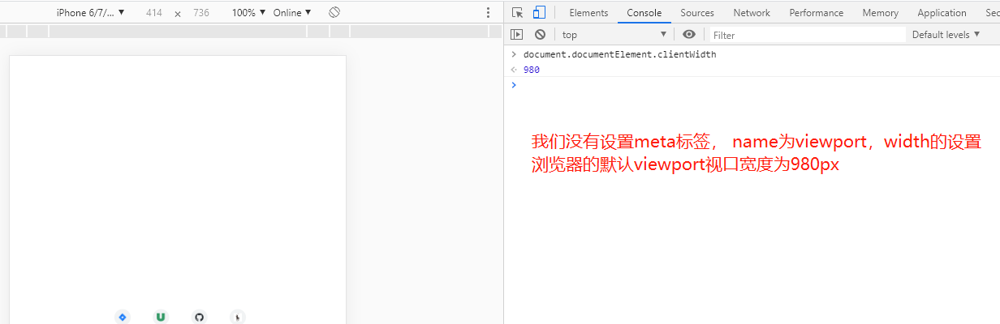

此时，我们设置body宽度为1200px, 大于移动端默认的viewport的可视宽度980，我们查看具体展示情况：

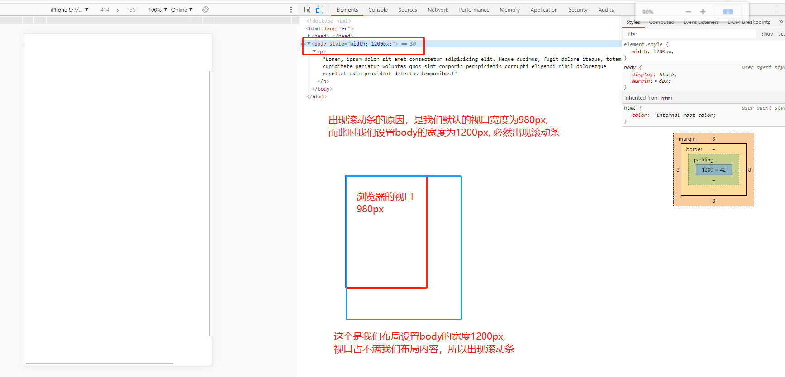

在移动端，我们进行如下设置
```html
<meta name="viewport" content="width=device-width, initial-scale=1.0">
```
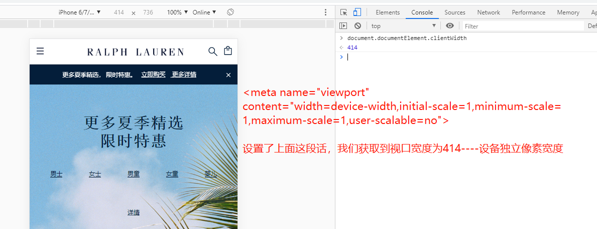


**由此我们可以得出，在移动端浏览器的viewport, 默认是980px,如果设置viewport标签，那么其viewport由设置决定。我们的布局宽度是相对于viewport宽度，如果布局宽度大于了viewport宽度，那么会出现滚动条，反之，则不会**

接下来，我们看一个现象，同样是300px * 300px的正方形，在桌面浏览器和移动端浏览器，展示的大小不一致。
这就是前面说的--即原本为桌面浏览器设置的网页，现在在移动端浏览器正常展示，但是会进行缩放。因为毕竟移动设备
的设备宽度比桌面浏览器的设备宽度，小得多。我们这个缩放比列是怎么计算出来的？

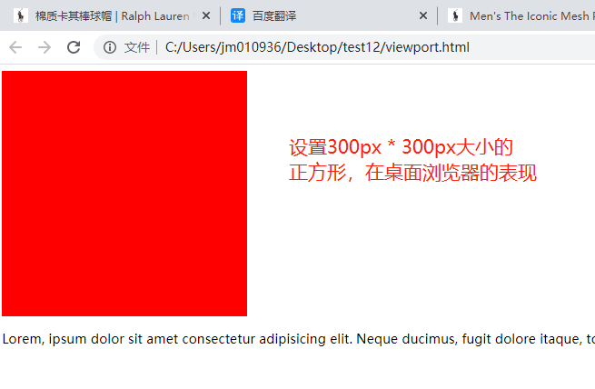
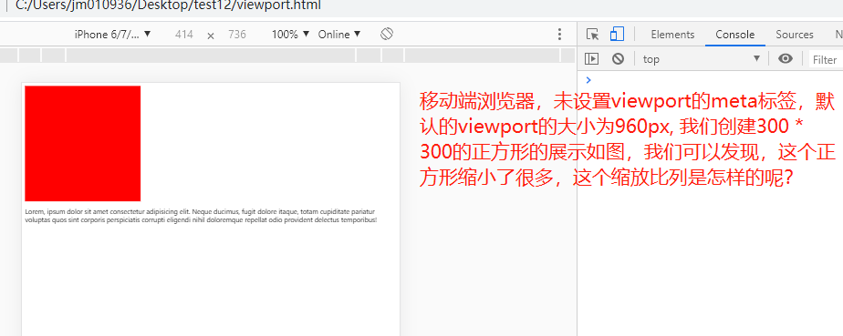
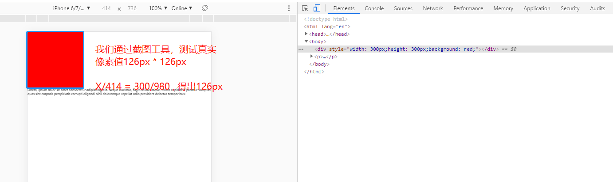


根据上面我们可以得出，在移动设备的浏览器中，我们未设置name为viewport的meta标签的时候，我们viewport默认为980px（谷歌浏览器），我们的缩放比例公式为

`x/移动端设备宽度（设备独立像素宽度） = 在桌面浏览器设置宽度 / 980`

设置了name为viewport的meta标签的时候，缩放比例公式：

`x/移动端设备宽度（设备独立像素宽度） = 在桌面浏览器设置宽度 / meta标签中设置的宽度`


## 两种viewport

通过上面，我们发现，在移动端设备中，在viewport默认为980px, 我们写的html,
是以这个进行布局。但是我们移动设备可视区域的大小，是远远比这个小的，例如
iPhone6/7/8设备的可视区域是375px(设备独立像素宽度)。

根据这样的现象，我们把在移动端设备中，在viewport默认为980px, 我们写的html,以这个viewport进行布局的称之为--**layoutviewport**
而我们移动设备中可视区域viewport称之为--**visualviewport**

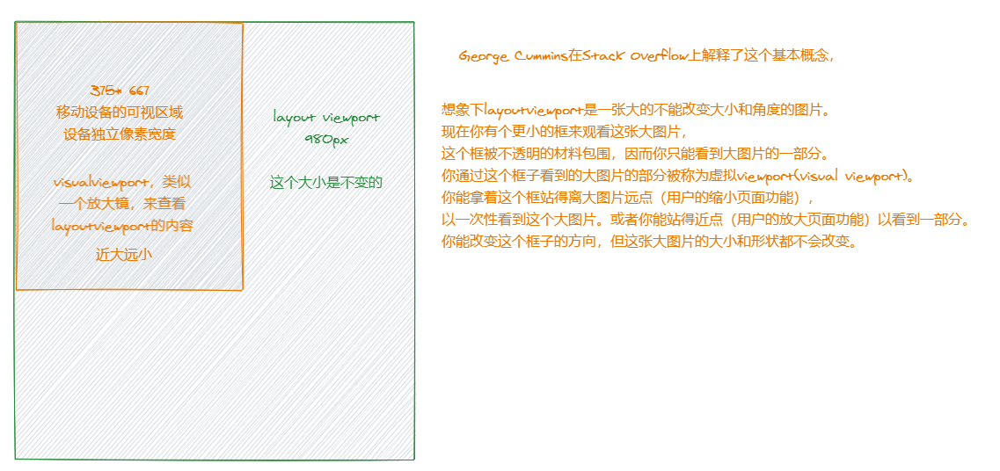

至此我们知道了，viewport是什么，在桌面浏览器和移动浏览器不同表现，以及layoutviewport和visualviewport的区别，算是了解了viewport的大部分了。
同时知道，在桌面浏览器中，我们的`layoutViewport == visualViewport`
而在移动端设置中`layoutViewport != visualViewport`。所以一般移动端设备
进行适配的时候，会通过`<meta name="viewport" content="width=device-width">`
把`layoutViewport == visualViewport`。

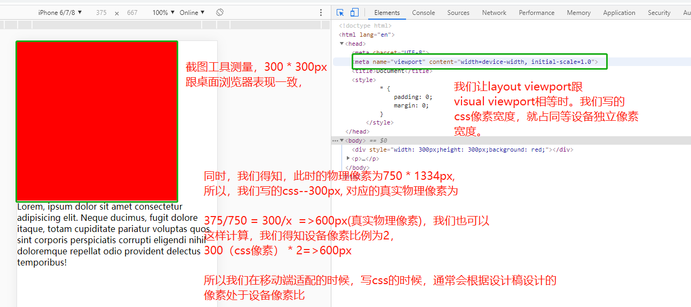


## 再看viewport的meta标签表现

```html
<meta name="viewport" content="width=device-width, initial-scale=1.0">
```
* width：控制 viewport 的大小，可以指定的一个值，如 600，或者特殊的值，
如 device-width 为设备的宽度（单位为缩放为 100% 时的 CSS 的像素）。
* height：和 width 相对应，指定高度。
* initial-scale：初始缩放比例，也即是当页面第一次 load 的时候缩放比例。
* maximum-scale：允许用户缩放到的最大比例。
* minimum-scale：允许用户缩放到的最小比例。
* user-scalable：用户是否可以手动缩放。

**看完上面，产生的疑问**

* with这个宽度指的是什么宽度？
这个从前面得出， 这个设置的是`visual viewport`， 因为当未设置
`<meta name="viewport" content="width=device-width">`, 在移动设备中，我们获取viewport的值
为980px(浏览器默认的值)，当我们设置了，获取的值为375px(针对的是iphone6/7/8)。

* initial-scale缩放的是什么？
这个我们可以得出，缩放的是`layoutViewport`。
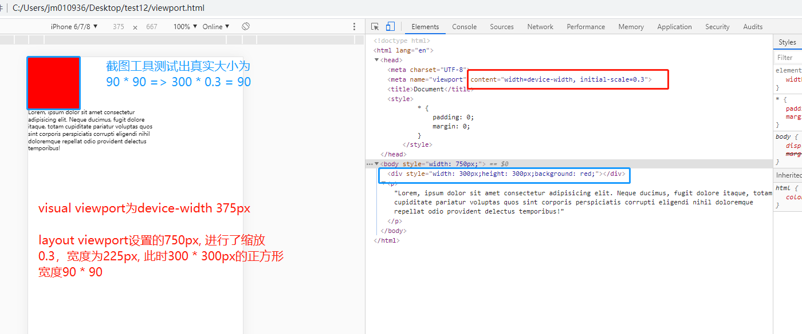

* device-width的宽度指的是什么？是分辨率像素宽度单位,还是设备独立像素？
从前面得到为设备独立像素宽度。因为在移动设备中我们设置`width=device-width`，可以得到
`layoutViewport == visualvViewport`，而`visualvViewport`此时代表设备独立像素宽度。
那么可以得出`device-width`是指的是设备独立像素。


## 参考链接

[移动前端开发之viewport的深入理解](https://www.cnblogs.com/2050/p/3877280.html)

[viewports剖析](https://www.w3cplus.com/css/viewports.html)
